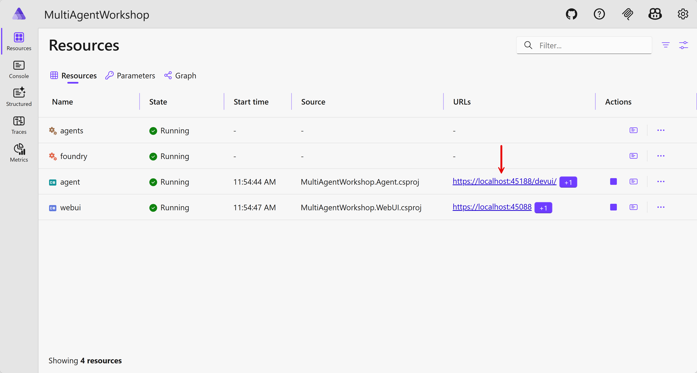
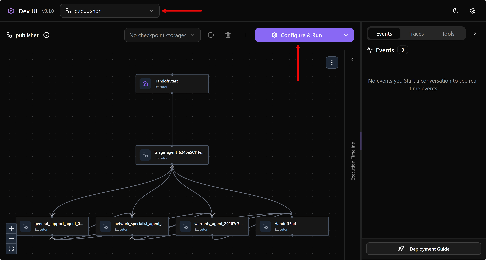
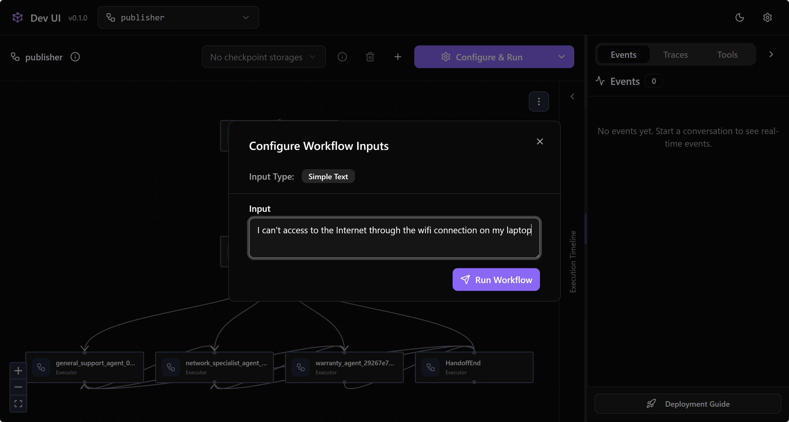
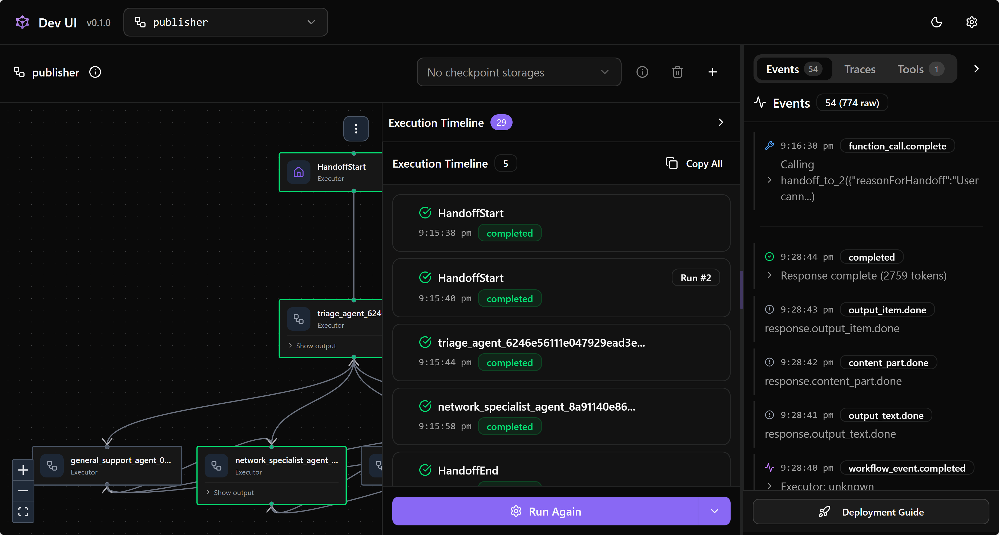
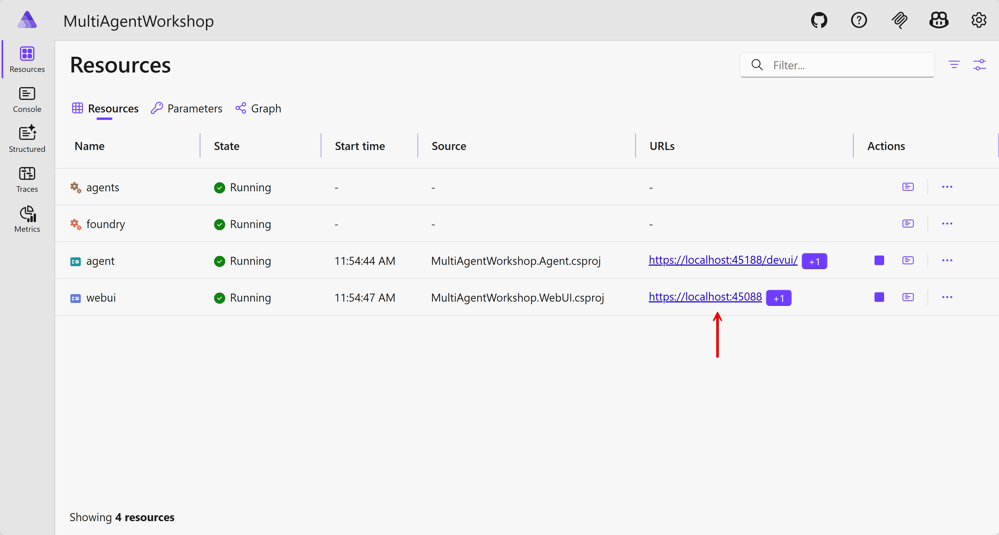
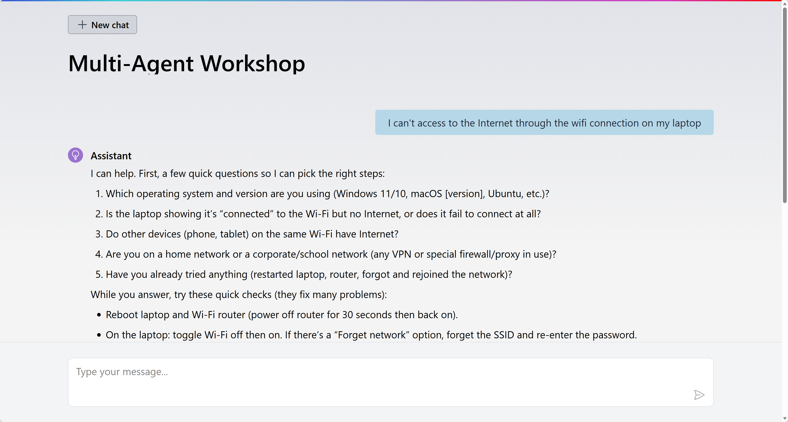

# 03 Handoff Pattern

In a handoff pattern, agents dynamically pass control to one another based on the conversation context. A triage agent receives the initial request and routes it to the specialist best suited to handle it. Specialists can also redirect to each other when the issue crosses domains. This works well for scenarios like IT support, customer service, or any workflow where different expertise is needed at different stages.

## Scenario

You're working for an IT support team with agents &ndash; general support agent, network specialist agent, warranty agent, and triage agent.

<div>
  
</div>

## Get the repository root

1. Get the `$REPOSITORY_ROOT` variable first.

    ```bash
    # zsh/bash
    REPOSITORY_ROOT=$(git rev-parse --show-toplevel)
    ```

    ```powershell
    # PowerShell
    $REPOSITORY_ROOT = git rev-parse --show-toplevel
    ```

## Copy the start project

1. If you already have the `workshop` directory, rename or remove it first.

1. Run the setup script to copy the start project to the `workshop` directory.

    ```bash
    # zsh/bash
    bash $REPOSITORY_ROOT/scripts/setup.sh --session 03-handoff-pattern
    ```

    ```powershell
    # PowerShell
    & $REPOSITORY_ROOT/scripts/setup.ps1 -Session 03-handoff-pattern
    ```

## Deploy agents

1. Make sure you're in the `workshop` directory.

    ```bash
    cd $REPOSITORY_ROOT/workshop
    ```

1. Open `src/MultiAgentWorkshop.PromptAgent/appsettings.json`, find the comment line `// Add agents`, and add the `Agents` property underneath it.

    ```jsonc
    {
      ...
      // Add agents
      "Agents": [
        {
          "Name": "triage-agent",
          "Version": "1"
        },
        {
          "Name": "general-support-agent",
          "Version": "1"
        },
        {
          "Name": "network-specialist-agent",
          "Version": "1"
        },
        {
          "Name": "warranty-agent",
          "Version": "1"
        }
      ]
      ...
    }
    ```

1. Navigate to the `resources-foundry` directory.

    ```bash
    pushd resources-foundry
    ```

1. Run the following command to provision and deploy the agents defined above to Microsoft Foundry.

    ```bash
    azd up
    ```

   While provisioning, you'll be asked to enter an environment name, Azure subscription, and location.

1. Once provisioning and deployment are done, run the following command to confirm that the agents have been deployed successfully.

    ```bash
    # zsh/bash
    az cognitiveservices agent list \
        -a $(azd env get-value FOUNDRY_NAME) \
        -p $(azd env get-value FOUNDRY_PROJECT_NAME) \
        --query "[].id" -o tsv
    ```

    ```bash
    # PowerShell
    az cognitiveservices agent list `
        -a $(azd env get-value FOUNDRY_NAME) `
        -p $(azd env get-value FOUNDRY_PROJECT_NAME) `
        --query "[].id" -o tsv
    ```

   You should see the four agent names.

    ```text
    warranty-agent
    network-specialist-agent
    general-support-agent
    triage-agent 
    ```

1. Navigate back to the workshop directory.

    ```bash
    popd
    ```

## Configure Aspire orchestration

1. Make sure you're in the `workshop` directory.

    ```bash
    cd $REPOSITORY_ROOT/workshop
    ```

1. Verify that all the necessary agent information has been recorded.

    ```bash
    dotnet user-secrets --project ./src/MultiAgentWorkshop.AppHost list
    ```

   You should see the `AZURE_TENANT_ID`, `FOUNDRY_NAME`, `FOUNDRY_PROJECT_NAME`, `FOUNDRY_RESOURCE_GROUP`, and `Foundry:Project:Endpoint` values.

1. Open `src/MultiAgentWorkshop.AppHost/appsettings.json`, find the comment line `// Add agents`, and add the `Agents` property underneath it.

    ```jsonc
    {
      ...
      // Add agents
      "Agents": [
        {
          "Name": "triage-agent",
          "Version": "1"
        },
        {
          "Name": "general-support-agent",
          "Version": "1"
        },
        {
          "Name": "network-specialist-agent",
          "Version": "1"
        },
        {
          "Name": "warranty-agent",
          "Version": "1"
        }
      ]
      ...
    }
    ```

1. Open `src/MultiAgentWorkshop.AppHost/AppHost.cs`, find the comment `// Add resource for Microsoft Foundry` and add the code right underneath it. This adds the Microsoft Foundry project connection details.

    ```csharp
    // Add resource for Microsoft Foundry
    var foundry = builder.AddFoundry("foundry");
    ```

   Let's break down the code.

   - `builder.AddFoundry("foundry")`: This adds the Microsoft Foundry connection details through a custom resource, `FoundryResource`. If you want to know more about the Aspire custom resource, visit [Create custom hosting integrations](https://aspire.dev/integrations/custom-integrations/hosting-integrations/).

1. In the same file, find the comment `// Add resource for agents on Microsoft Foundry` and add the code right underneath it. This exposes the list of agent details to the referencing application.

    ```csharp
    // Add resource for agents on Microsoft Foundry
    var agents = builder.AddAgents("agents");
    ```

   Let's break down the code.

   - `builder.AddAgents("agents")`: This adds the list of agent details through a custom resource, `AgentResource`. If you want to know more about the Aspire custom resource, visit [Create custom hosting integrations](https://aspire.dev/integrations/custom-integrations/hosting-integrations/).

1. In the same file, find the comment `// Add backend agent service` and add the code right underneath it. This defines the backend agent service that references the `foundry` resource — all the Microsoft Foundry connection details are passed to the backend agent service app.

    ```csharp
    // Add backend agent service
    var agent = builder.AddProject<MultiAgentWorkshop_Agent>("agent")
                       .WithReference(foundry);
    ```

   Let's break down the code.

   - `builder.AddProject<MultiAgentWorkshop_Agent>("agent")`: This adds the backend agent service app as a .NET project.
   - `.WithReference(foundry)`: This references the foundry resource created above, which passes the Microsoft Foundry connection details to the backend agent service app.

1. In the same file, find the comment `// Add frontend web UI` and add the code right underneath it. This defines the frontend web UI that references both the `agents` and `agent` resources — the agent details and backend connection details are both passed to the frontend web UI app.

    ```csharp
    // Add frontend web UI
    var webUI = builder.AddProject<MultiAgentWorkshop_WebUI>("webui")
                       .WithExternalHttpEndpoints()
                       .WithReference(agents)
                       .WithReference(agent)
                       .WaitFor(agent);
    ```

   Let's break down the code.

   - `builder.AddProject<MultiAgentWorkshop_WebUI>("webui")`: This adds the frontend web UI app as a .NET project.
   - `.WithExternalHttpEndpoints()`: This exposes this frontend web UI app to the Internet, which is publicly accessible.
   - `.WithReference(agents)`: This references the agent resource created above, which passes the list of agents to the frontend web UI app.
   - `.WithReference(agent)`: This references the backend agent service app, which passes the connection details to the frontend web UI app.

## Implement handoff pattern on backend agent service

1. Make sure you're in the `workshop` directory.

    ```bash
    cd $REPOSITORY_ROOT/workshop
    ```

1. Open `src/MultiAgentWorkshop.Agent/Program.cs`, find the comment `// Create AzureOpenAIClient instance with EntraID authentication` and add the code right underneath it. This connects to the Microsoft Foundry project.

    ```csharp
    // Create AzureOpenAIClient instance with EntraID authentication
    var credential = new DefaultAzureCredential(new DefaultAzureCredentialOptions() { TenantId = config["AZURE_TENANT_ID"] });

    var chatClient = new AzureOpenAIClient(new Uri(endpoint), credential)
                        .GetResponsesClient()
                        .AsIChatClient(model);
    ```

   Let's break down the code.

   - `new DefaultAzureCredential(...)`: This logs in to Azure without an API key. It uses your Azure CLI login or Azure Developer CLI login details on your local machine, and Managed Identity when the app is deployed to Azure.
   - `new AzureOpenAIClient(new Uri(endpoint), credential)`: This connects to the Azure OpenAI instance using the endpoint and login details and converts it to an `IChatClient` instance.

1. In the same file, find the comment `// Register all agents passed from Aspire` and add the code right underneath it. This pulls the agent details from the Microsoft Foundry project and registers them in the IoC container as singleton services.

    ```csharp
    // Register all agents passed from Aspire
    foreach (var agentSettings in agents)
    {
        var instruction = await File.ReadAllTextAsync(
            Path.Combine(AppContext.BaseDirectory, "Prompts", $"{agentSettings.Name}.txt"));

        var agent = new ChatClientAgent(
            chatClient,
            instructions: instruction,
            name: agentSettings.Name);

        builder.Services.AddKeyedSingleton<AIAgent>(agentSettings.Name, agent);
    }
    ```

   Let's break down the code.

   - We already know the list of agents but only know their names. Therefore, the code runs the `foreach` loop for each agent.
   - `await File.ReadAllTextAsync(...)`: This imports the agent instruction file.
   - `new ChatClientAgent(chatClient, instructions, name)`: Using each agent's information, instruction, and the `IChatClient` instance, this creates an agent instance.
   - `builder.Services.AddKeyedSingleton<AIAgent>(name, agent)`: This registers the agent instance as a singleton service.

1. In the same file, find the comment `// Build a handoff workflow pattern with the agents registered` and add the code right underneath it.

    ```csharp
    // Build a handoff workflow pattern with the agents registered
    builder.AddWorkflow("publisher", (sp, key) =>
    {
        var triage = sp.GetRequiredKeyedService<AIAgent>("triage-agent");
        var generalSupport = sp.GetRequiredKeyedService<AIAgent>("general-support-agent");
        var networkSpecialist = sp.GetRequiredKeyedService<AIAgent>("network-specialist-agent");
        var warranty = sp.GetRequiredKeyedService<AIAgent>("warranty-agent");

        var specialists = new[] { generalSupport, networkSpecialist, warranty };

        var workflow = AgentWorkflowBuilder.CreateHandoffBuilderWith(triage)
            // Triage can hand off to any specialist
            .WithHandoffs(triage, specialists)
            // Each specialist can hand off to other specialists
            .WithHandoffs(generalSupport, [networkSpecialist, warranty])
            .WithHandoffs(networkSpecialist, [generalSupport, warranty])
            .WithHandoffs(warranty, [generalSupport, networkSpecialist])
            // All specialists hand back to triage
            .WithHandoffs(specialists, triage, "Hand back to triage when the issue is resolved or needs further routing")
            .Build();

        // HandoffWorkflowBuilder.Build() doesn't set the workflow name.
        // Set it via reflection so AddWorkflow's name validation passes.
        typeof(Workflow).GetProperty("Name")!.SetValue(workflow, key);

        return workflow;
    }).AddAsAIAgent("publisher");
    ```

   Let's break down the code.

   - `var specialists = new[] { generalSupport, networkSpecialist, warranty };`: This defines the list of specialist agents. The triage agent is the starting point that reroutes the user request to one of the specialist agents.
   - `builder.AddWorkflow("publisher", ...).AddAsAIAgent("publisher")`: This adds the multi-agent workflow as another agent instance named `publisher` and registers it as a singleton.
   - `AgentWorkflowBuilder.CreateHandoffBuilderWith(triage)`: This is the handoff workflow builder with the triage agent.
   - `.WithHandoffs(triage, specialists)`: This defines the handoff from the triage agent to the specialist agents.
   - `.WithHandoffs(generalSupport, [networkSpecialist, warranty])`: This defines the handoff from the general-support agent to the other specialist agents.
   - `.WithHandoffs(networkSpecialist, [generalSupport, warranty])`: This defines the handoff from the network-specialist agent to the other specialist agents.
   - `.WithHandoffs(warranty, [generalSupport, networkSpecialist])`: This defines the handoff from the warranty agent to the other specialist agents.
   - `.WithHandoffs(specialists, triage, "Hand back to triage when the issue is resolved or needs further routing")`: This defines the handoff from all specialist agents back to the triage agent when the issue is resolved or needs further routing.
   - `typeof(Workflow).GetProperty("Name")!.SetValue(workflow, key);`: This injects the workflow name, which is a temporary workaround.

1. In the same file, find the comment `// Map AGUI to the publisher workflow agent` and add the code right underneath it. The workflow is exposed as an API endpoint at `ag-ui` so that the frontend web UI can communicate with this backend agent service app.

    ```csharp
    // Map AGUI to the publisher workflow agent
    app.MapAGUI(
        pattern: "ag-ui",
        aiAgent: app.Services.GetRequiredKeyedService<AIAgent>("publisher")
                             .CreateFixedAgent()
    );
    ```

   Note that `.CreateFixedAgent()` is a temporary workaround until the output stream is handled properly.

## Implement handoff pattern on frontend web UI

1. Make sure you're in the `workshop` directory.

    ```bash
    cd $REPOSITORY_ROOT/workshop
    ```

1. Open `src/MultiAgentWorkshop.WebUI/Program.cs`, find the comment `// Register all agents passed from Aspire` and add the code right underneath it. This registers all the agent details so that the web UI knows which agent is responding.

    ```csharp
    // Register all agents passed from Aspire
    builder.Services.AddSingleton(agents);
    ```

1. In the same file, find the comment `// Register the backend agent service as an HTTP client` and add the code right underneath it. Aspire already provides the frontend web UI app with the connection details for the backend agent service.

    ```csharp
    // Register the backend agent service as an HTTP client
    builder.Services.AddHttpClient("agent", client =>
    {
        client.BaseAddress = new Uri("https+http://agent");
    });
    ```

1. In the same file, find the comment `// Register AGUI client` and add the code right underneath it. Using this AGUI client, the frontend web UI app communicates with the backend agent service app via the `ag-ui` endpoint.

    ```csharp
    // Register AGUI client
    builder.Services.AddChatClient(sp => new AGUIChatClient(
        httpClient: sp.GetRequiredService<IHttpClientFactory>().CreateClient("agent"),
        endpoint: "ag-ui")
    );
    ```

## Run Aspire

1. Make sure you're in the `workshop` directory.

    ```bash
    cd $REPOSITORY_ROOT/workshop
    ```

1. Make sure you've already logged in to Azure using both Azure CLI and Azure Developer CLI. If you're unsure, follow [this step](./00-setup.md#log-in-to-azure) again.

1. Run the following command to start all apps through Aspire.

    ```bash
    dotnet watch run --project ./src/MultiAgentWorkshop.AppHost
    ```

1. The Aspire dashboard opens automatically.

   

   Click the backend agent service app.

1. When the Dev UI page opens, change the agent to `publisher` and see that the triage agent distributes the request to the other agents.

   

1. Send any request.

   

   See the result and how the workflow progresses on the left-hand side of the screen.

   

1. Go back to the Aspire dashboard and click the web UI app.

   

1. Send any request.

   

   See the result.

1. Press `Ctrl`+`C` to terminate all running apps.

## Deploy to Azure

1. Make sure you're in the `workshop` directory.

    ```bash
    cd $REPOSITORY_ROOT/workshop
    ```

1. Run the following command to provision and deploy both the frontend web UI and backend agent service apps to Azure.

    ```bash
    azd up
    ```

   While provisioning, you'll be asked to enter an environment name, Azure subscription, and location.

1. Once completed, you'll see the web UI application URL on the terminal screen. Open it in your web browser and send a request.

   

   See the result.

1. Once everything is done, remove all the apps and agents from Azure.

    ```bash
    # Delete both the web UI and agent service apps.
    azd down --purge --force

    # Delete all agents and the Microsoft Foundry resource.
    cd resources-foundry
    azd down --purge --force
    ```

---

Congratulations! 🎉 You've just completed the third multi-agent orchestration scenario &ndash; the handoff pattern. Let's move on!

👈 [02: Concurrent Pattern](./02-concurrent-pattern.md) | [04: Group Chat Pattern](./04-group-chat-pattern.md) 👉
