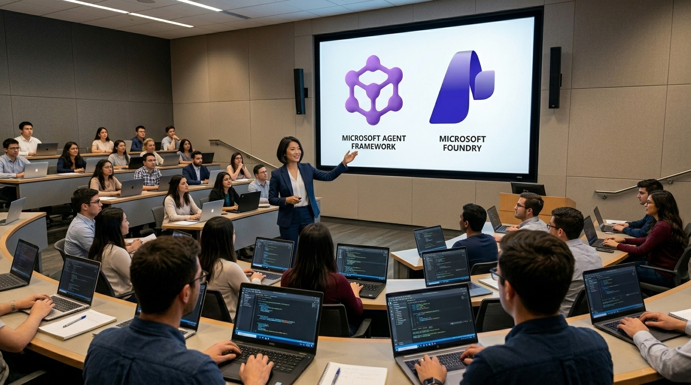

# マルチエージェント オーケストレーション ワークショップ

これは、[Microsoft Agent Framework](https://aka.ms/agent-framework)、[Microsoft Foundry](https://aka.ms/microsoft-foundry)、および [Aspire](https://aspire.dev) を使用して .NET ベースのマルチエージェント アプリを構築するためのワークショップ資料です。

## このワークショップの目的は？

単一エージェント アプリの構築は簡単です。しかし、複数のエージェントが連携する必要がある実世界のユースケースは多く、マルチエージェント アプリの構築は単一エージェントのものほど単純ではありません。[Microsoft Agent Framework](https://aka.ms/agent-framework) は、5つのマルチエージェント オーケストレーション パターンを提供しています：

| パターン                                                                                                                          | 説明                                                       |
|----------------------------------------------------------------------------------------------------------------------------------|------------------------------------------------------------|
| [Sequential](https://learn.microsoft.com/agent-framework/workflows/orchestrations/sequential?pivots=programming-language-csharp) | エージェントが定義された順序で順番に実行されます            |
| [Concurrent](https://learn.microsoft.com/agent-framework/workflows/orchestrations/concurrent?pivots=programming-language-csharp) | エージェントが並列で実行されます                           |
| [Handoff](https://learn.microsoft.com/agent-framework/workflows/orchestrations/handoff?pivots=programming-language-csharp)       | エージェントがコンテキストに基づいて制御を相互に転送します |
| [Group Chat](https://learn.microsoft.com/agent-framework/workflows/orchestrations/group-chat?pivots=programming-language-csharp) | エージェントが共有の会話で協力します                       |
| [Magentic](https://learn.microsoft.com/agent-framework/workflows/orchestrations/magentic?pivots=programming-language-python)     | マネージャー エージェントが専門エージェントを動的に調整します |

## 特徴

このワークショップでは、Magentic パターンを除くすべてのマルチエージェント オーケストレーション パターンを構築します。各パターンを完了すると、以下のアーキテクチャが構築されます：

- [Blazor](https://blazor.net) によるチャット UI のフロントエンド
- [ASP.NET](https://asp.net) と [Microsoft Agent Framework](https://aka.ms/agent-framework) によるバックエンド
- [Microsoft Foundry Agent Service](https://aka.ms/microsoft-foundry/agent-service) によるエージェント ホスティング
- [Aspire](https://aspire.dev) によるクラウドネイティブ アプリ オーケストレーション

> [!NOTE]
> Microsoft Agent Framework SDK の .NET バージョンは、今後のリリースで Magentic パターンをサポートする予定です。

## 前提条件

- [Azure サブスクリプション（無料）](http://azure.microsoft.com/free)
- [.NET 10 SDK](https://dotnet.microsoft.com/download/dotnet/10.0) 以上
- [Visual Studio 2026](https://visualstudio.microsoft.com/downloads/) または [VS Code](https://code.visualstudio.com/download) + [C# Dev Kit](https://marketplace.visualstudio.com/items?itemName=ms-dotnettools.csdevkit)
- [Docker Desktop](https://docs.docker.com/desktop/) または同等のツール
- [GitHub CLI](https://cli.github.com)
- [Azure Developer CLI](https://learn.microsoft.com/azure/developer/azure-developer-cli/install-azd)
- [Azure CLI](https://learn.microsoft.com/cli/azure/install-azure-cli)
- [Aspire CLI](https://aspire.dev/get-started/install-cli/)

## ワークショップ セッション

| セッション            | ドキュメント                                                | コードサンプル                                           |
|-----------------------|-------------------------------------------------------------|----------------------------------------------------------|
| 00 セットアップ       | [00-setup.md](./docs/00-setup.md)                           |                                                          |
| 01 Sequential パターン | [01-sequential-pattern.md](./docs/01-sequential-pattern.md) | [01-sequential-pattern](./samples/01-sequential-pattern) |
| 02 Concurrent パターン | [02-concurrent-pattern.md](./docs/02-concurrent-pattern.md) | [02-concurrent-pattern](./samples/02-concurrent-pattern) |
| 03 Handoff パターン    | [03-handoff-pattern.md](./docs/03-handoff-pattern.md)       | [03-handoff-pattern](./samples/03-handoff-pattern)       |
| 04 Group Chat パターン | [04-group-chat-pattern.md](./docs/04-group-chat-pattern.md) | [04-group-chat-pattern](./samples/04-group-chat-pattern) |

## お好みの言語をご利用ください！

このワークショップ資料は以下の言語でご利用いただけます。

[English](../../README.md) | [Español](../es-es/README.md) | [日本語](./README.md) | [한국어](../ko-kr/README.md) | [Português](../pt-br/README.md) | [中文(简体)](../zh-cn/README.md)

## リソース

- [Microsoft Agent Framework](https://aka.ms/agent-framework)
- [Microsoft Agent Framework - Workflow Orchestrations](https://learn.microsoft.com/agent-framework/workflows/orchestrations)
- [Microsoft Foundry](https://aka.ms/microsoft-foundry)
- [Microsoft Foundry Agent Service](https://aka.ms/microsoft-foundry/agent-service)
- [Model Context Protocol (MCP)](https://modelcontextprotocol.io)
- [Aspire](https://aspire.dev)
