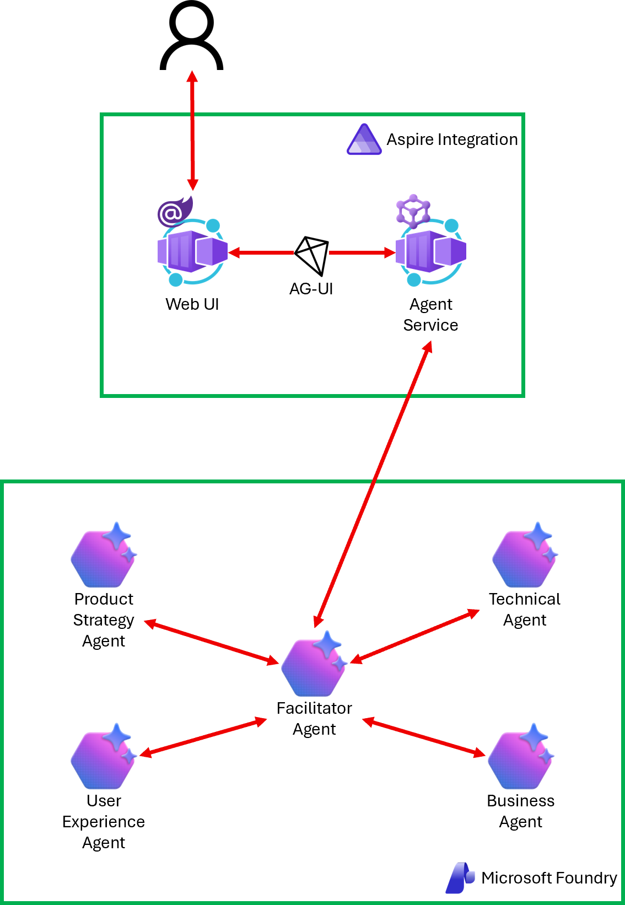

# 04 Padrão de Chat em Grupo

No padrão de chat em grupo, múltiplos agentes participam de uma conversa compartilhada, contribuindo com sua especialidade em turnos. Um orquestrador gerencia o fluxo da discussão, decidindo qual agente fala em seguida e quando a conversa deve terminar. Isso é adequado para planejamento multifuncional, brainstorming criativo ou qualquer tarefa onde perspectivas diversas precisam interagir e construir umas sobre as outras de forma iterativa.

  

## Instruções

Siga as instruções em [04-group-chat-pattern.md](../../docs/04-group-chat-pattern.md) com o projeto [start](../../../../samples/04-group-chat-pattern/start).

Após concluir, compare o seu resultado com o projeto [complete](../../../../samples/04-group-chat-pattern/complete).
