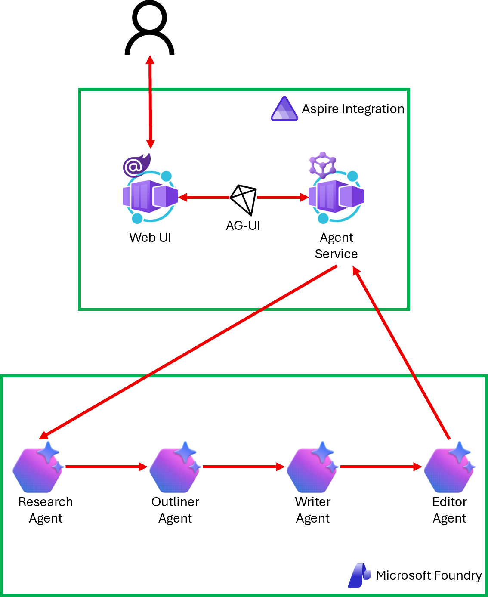

# 01 Sequential Pattern

In a sequential pattern, agents work one after another in a defined pipeline, where each agent's output feeds into the next. This approach works well for tasks that follow a natural progression, like content creation workflows, staged data transformations, or step-by-step analysis.

## Instruction

Follow the instruction, [01-sequential-pattern.md](../../docs/01-sequential-pattern.md) with the [start](./start) project.

Once you complete, compare yours to the [complete](./complete) project.
