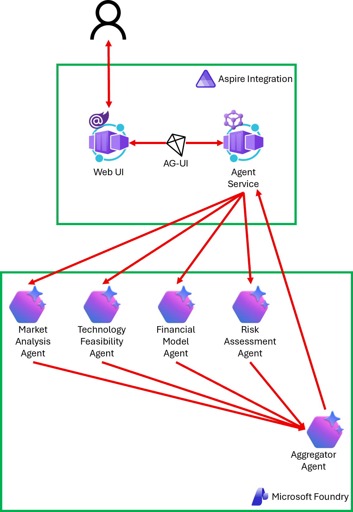

# 02 Concurrent Pattern

In a concurrent pattern, multiple agents analyse the same input simultaneously, each bringing its own expertise. Once all agents complete, their outputs are combined into a unified result. This is ideal for tasks that benefit from multiple viewpoints working at the same time, such as multi-perspective analysis, ensemble evaluation, or collaborative decision-making.

  

## Instruction

Follow the instruction, [02-concurrent-pattern.md](../../docs/02-concurrent-pattern.md) with the [start](./start) project.

Once you complete, compare yours to the [complete](./complete) project.
