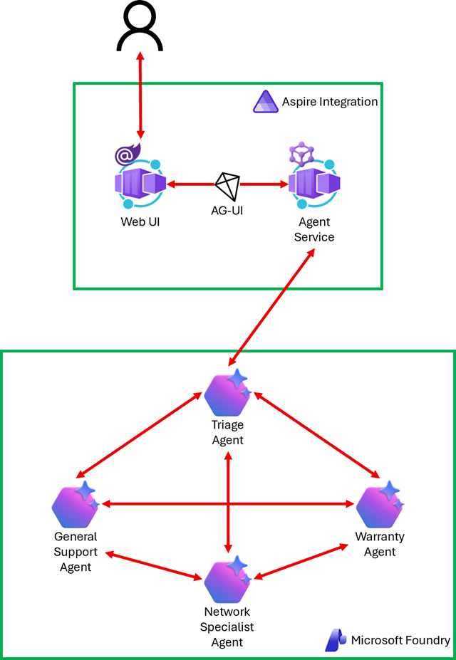

# 03 Handoff Pattern

In a handoff pattern, agents dynamically pass control to one another based on the conversation context. A triage agent receives the initial request and routes it to the specialist best suited to handle it. Specialists can also redirect to each other when the issue crosses domains. This works well for scenarios like IT support, customer service, or any workflow where different expertise is needed at different stages.

## Instruction

Follow the instruction, [03-handoff-pattern.md](../../docs/03-handoff-pattern.md) with the [start](./start) project.

Once you complete, compare yours to the [complete](./complete) project.
